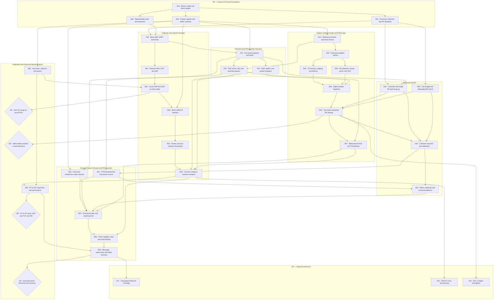

# Direction aware router implementation plan

Build a two-node IPv4 router in stages so that Ethernet, firmware, modem, and RF failures can be isolated. The first three demonstrations are a PC pinging its local FPGA, two FPGA nodes exchanging valid radio packets, and two PCs exchanging ordinary IP traffic through those nodes. Automatic beam discovery follows the fixed-link demonstration.

Ticket IDs refer to [the backlog](backlog.md) and map to published GitHub issues through the [live issue index](github-issues.md); they are distinct from GitHub issue numbers.

## Dependency graph

Arrows mean that the predecessor supplies a needed result. Work in separate branches can proceed in parallel. Milestone diamonds are demonstrations, not additional implementation tickets. The gate arrows emphasize integration order; the backlog lists every ticket prerequisite.

## Architecture to build first

Use routed IPv4 with static addresses and routes for the first PC-to-PC demonstration. A node has an Ethernet interface for its companion PC and one point-to-point radio IP interface for its peer. Application endpoints remain on the PCs.

```mermaid
flowchart LR
  A["PC A"] <-->|Ethernet| AE["Node A · eth0"]
  AE <--> AL["lwIP forwarding"]
  AL <--> AR["radio0 + link driver"]
  AR <--> AM["FPGA modem + RF"]
  AM <-->|Wireless| BM["RF + FPGA modem"]
  BM <--> BR["radio0 + link driver"]
  BR <--> BL["lwIP forwarding"]
  BL <--> BE["Node B · eth0"]
  BE <-->|Ethernet| B["PC B"]
```

| Segment | Node or PC | Proposed address |
|---|---|---|
| LAN A | PC A | `192.168.10.2/24` |
| LAN A | Node A Ethernet | `192.168.10.1/24` |
| Radio transit | Node A radio | `10.255.0.1/30` |
| Radio transit | Node B radio | `10.255.0.2/30` |
| LAN B | Node B Ethernet | `192.168.20.1/24` |
| LAN B | PC B | `192.168.20.2/24` |

PC A routes `192.168.20.0/24` through `192.168.10.1`; PC B routes `192.168.10.0/24` through `192.168.20.1`. Each node routes the remote LAN through its radio peer. Use specific remote-LAN routes so the experiment need not change the PCs' ordinary Internet default routes. Check that these example ranges do not overlap other active host networks. NAT is unnecessary for this topology.

A local ping only proves Ethernet, addressing, ARP and ICMP. The forwarding milestone must send packets addressed to the remote PC through two interfaces, preserving the PC source and destination addresses and performing normal IP TTL handling. A program that receives a TCP stream and creates a new connection is an application relay; it does not satisfy this routing demonstration.

lwIP supplies IPv4 forwarding and routing hooks; pin and inspect the actual AMD BSP version before using them. `IP_FORWARD` must be enabled for forwarding. A route hook selects an interface, while the project owns the desired route policy and metadata. [lwIP configuration](https://www.nongnu.org/lwip/2_1_x/opt_8h.html), [lwIP hooks](https://www.nongnu.org/lwip/2_1_x/group__lwip__opts__hooks.html).

For the proposed design, keep one `radio0` netif and store beam choices in a separate neighbor/link table. A beam change selects a new physical path for the same peer; it need not create a new IP interface or subnet. Model the lookup as:

`destination prefix → radio0 + peer ID → current local TX/RX beam selections → modem`

The direction-aware research contribution remains measurable: discovery determines whether a peer is reachable, which beam pair serves it, its link quality, and when the usable route must be withdrawn or restored. With only two nodes, the experiment demonstrates directional link selection and route availability, not multi-hop path selection.

HAIL and ACK are link-control frames that work before an IP route exists. A matching bidirectional exchange updates the neighbor table; the route manager then activates the remote-LAN route using a configured peer-to-prefix mapping. Energy detection alone does not validate a neighbor. Record separate local TX and RX beam IDs and remote selections where exchanged; local angle conventions are not automatically identical at the two nodes.

Route expiry must prevent unintended forwarding. Returning `NULL` from the lwIP route hook resumes ordinary route lookup rather than explicitly dropping the packet. Ensure a withdrawn remote-LAN route cannot fall back to an inappropriate default interface, and revalidate or discard queued radio packets when their neighbor expires. B04/B05 must demonstrate this behavior. [lwIP hook return behavior](https://www.nongnu.org/lwip/2_1_x/group__lwip__opts__hooks.html).

## Modules and ownership boundaries

These are seven workstreams, not a requirement for seven people. Assign one primary owner and one reviewer to each after confirming team size. Shared-boundary changes require review from both affected modules.

| Module | Work and suggested location | Inputs and deliverable | Initial ticket families |
|---|---|---|---|
| Hardware and RF | `hardware/`: board map, Ethernet PHY connections, converters/transceivers, clocks/LO, antennas, RF fixtures, calibration measurements | Selected hardware → known sample path and measured calibrated beams | H01–H05 |
| Embedded platform and transport | `firmware/platform/`, `firmware/drivers/`, `fpga/rtl/transport/`: boot, timers, AXI registers, DMA, interrupts, caches, buffer ownership | CPU packets and control → reliable FPGA transfers with bounded queues | F01–F03 |
| Networking | `firmware/net/`: Ethernet adapter, `radio0`, lwIP settings, route policy, IP packet forwarding | Valid IP packets and link state → local ICMP plus PC-to-PC connectivity | N01–N05 |
| Modem | `sim/`, `fpga/rtl/modem/`: reference models, framing, fixed point, modulation, filtering, burst acquisition, timing/carrier recovery, CRC | Link frames ↔ baseband samples | D01–D07 |
| Link scheduling and beam control | `firmware/link/`, `fpga/rtl/beam/`: TDD ownership, ACK/retry, TX weighting, RX combining, atomic coefficient application | Frames, samples, beam requests and RF timing → scheduled transmissions, steered samples and confirmed beam state | F04, B01 |
| Discovery and directional policy | `firmware/discovery/`: rendezvous, HAIL validation, neighbor lifecycle, quality, freshness, hysteresis | Validated link events → usable peer and beam selection, expiry and recovery | B02–B05 |
| Integration and tooling | `tools/`, `tests/`, `docs/`: contracts, repeatable builds, host traffic tools, evidence, regression and demonstrations | All module outputs → reproducible milestone evidence | S01–S05 |

The hardware owner owns channel calibration in H04 and the measured codebook in H05. The beam-control owner implements or integrates the sample-weighting/combining datapath and coefficient application in B01. The discovery owner chooses among validated beam entries. The network owner turns usable-neighbor state into forwarding policy. This separates tasks that otherwise tend to be assigned ambiguously as "beamforming."

B01 first validates known weights against H04 calibration: TX distributes and weights samples across antenna paths; RX aligns, weights and combines samples before modem decoding. H05 then measures the resulting patterns and validates the steering codebook. If the chosen front end performs part of this in hardware, document that boundary and test the integrated behavior. D06 can test each direction in separate manually controlled runs before F04 supplies automated half-duplex scheduling.

## Milestone exit criteria

| Milestone | Required demonstration | Proposed evidence and initial gate |
|---|---|---|
| M0 Foundations | Hardware feasibility, scope and shared interfaces are written down | Exact parts, RF channel map, tool versions, link/frame and CPU/FPGA contracts; owners agree on achievable operating envelope |
| M1 Local network | Each PC can ping its own node over Ethernet | After ARP warm-up, 1,000 ICMP replies out of 1,000 on each local connection; UDP payload preserved; save capture, UART log and build ID |
| M2 Modem bench | Independent nodes exchange CRC-valid payloads over conducted RF | Ideal digital cases match reference; corrupt frames rejected; 10,000 frames per direction with packet error rate at most 1% at a recorded operating point; report unique payload delivery separately from retries |
| M3 Routed wireless | PC A and PC B communicate through both FPGA nodes over a fixed wireless path | At least 99% of 1,000 pings each direction; 10-minute sequenced UDP run at a stated rate below measured capacity with at most 1% loss; 10 MB TCP file with matching SHA-256; route/TTL and link interruption evidence |
| M4 Direction aware | Nodes discover a beam pair, install usable forwarding state, and recover after disturbance | 20 controlled discovery/recovery trials; at least 19 restore traffic within a timeout chosen from the scan schedule in S01/B02; record angle, quality, discovery time, route expiry and recovery time |
| M5 Optional | L2 bridge, easier host setup or modem performance extension | Separate acceptance test for each approved extension; completion is not needed to claim M1–M4 |

For every RF result, record carrier frequency, modulation, symbol/sample rates, packet lengths, gains, attenuation or distance/orientation, oscillator arrangement and build IDs. Report both pre-retry packet errors and application delivery so retries do not hide modem problems. Throughput, range, bandwidth and recovery-time commitments remain unset until S01 establishes feasible targets.

## Shared contracts to freeze early

| Boundary | Required agreement before independent implementation |
|---|---|
| lwIP ↔ radio adapter | Raw IPv4 packets for v1; MTU; scatter/gather or copy rules; RX callback context; TX ownership until completion; link-down behavior; bounded queue depth; checksum responsibility |
| CPU ↔ FPGA | Register addresses and version; reset sequence; endianness; packet length and boundaries; AXI stream `TLAST`/`TKEEP` where used; DMA buffer alignment and memory visibility; interrupts, completion and error reporting |
| Link ↔ modem | Versioned preamble/header/payload/CRC; DATA, HAIL and ACK types; source/destination node IDs; sequence and transaction identity; maximum payload; invalid-length rejection; PHY acquisition and airtime assumptions |
| Beam controller ↔ RF/FPGA | Channel order; coefficient representation; calibration plus steering composition; TX/RX bank selection; angle convention; switch latency; apply only at allowed packet boundaries; applied-beam acknowledgement |
| Discovery ↔ routing | Peer ID; selected local TX and RX beams; quality and its units; last validated time; expiry; neighbor state; route activation/withdrawal event; fixed remote-prefix mapping for the two-node baseline |
| Modules ↔ test harness | Build ID; monotonic timestamps; frame TX/RX/CRC counters; drops and reasons; DMA failures; queue occupancy; heap/pbuf statistics; active beam; neighbor state and route changes |

Proposed buffer strategy: start with bounded copies between lwIP and dedicated DMA buffers. Make ownership explicit before optimizing for zero-copy. RF will often drain more slowly than Ethernet arrives; queue-full and link-down paths must fail predictably instead of allocating indefinitely.

For a raw-IP radio interface, do not forward local Ethernet headers or require Ethernet ARP on that radio path. Recompute or validate the appropriate IP/transport checksums in software unless the actual radio datapath provides equivalent offload. At S03 choose an explicit MTU policy: either constrain every test endpoint to an agreed supported IP MTU, or implement and test the needed fragmentation/reassembly and DF/ICMP behavior. Do not silently truncate a 1,500-byte IP packet to fit a smaller radio payload.

Use one supported lwIP execution model. In bare-metal mainloop mode, service input and timers from the intended context; DMA interrupts should hand off work rather than calling arbitrary lwIP paths. An RTOS design must respect its lwIP core-thread rules. [lwIP mainloop guidance](https://www.nongnu.org/lwip/2_1_x/group__lwip__nosys.html).

## Hardware and modem decisions that can block progress

1. **Prove the number of RF antenna paths.** Four real DAC or ADC channels can correspond to two complex I/Q paths, depending on the architecture. Confirm the actual converter/transceiver topology, Ethernet MAC/PHY availability, clocking, processor memory and required IP licenses before designing around four elements.
2. **Separate local coherence from over-the-air synchronization.** Channels inside one array need deterministic alignment and measured TX/RX phase/amplitude correction. Independent radio nodes still need carrier and timing recovery. A shared bench reference may help debugging, but the final two-node test must meet the intended independent-clock requirement. [ADI synchronization and calibration guide](https://wiki.analog.com/resources/eval/user-guides/quadmxfe/multichipsynchronization).
3. **Begin with a modest single-carrier burst modem.** BPSK or QPSK is a proposed starting choice, subject to the model and hardware rate budget. The receiver needs burst detection, matched filtering, timing/carrier recovery, phase-ambiguity handling, framing and CRC. A working continuous-stream example is not proof that short hails acquire reliably. [Hardware-oriented QPSK example and receiver limitations](https://www.mathworks.com/help/wireless-hdl/ug/qpsk-transmitter-receiver.html).
4. **Budget RF levels before a conducted test.** Record measured transmitter output, path/attenuator loss and receiver limits for the selected equipment. Validate one path before combining all array channels. Confirm mixers/LOs, filters, amplifiers and transmit/receive isolation where the chosen front end requires them.
5. **Design a rendezvous protocol.** Two nodes independently sweeping narrow beams can repeatedly miss each other. Choose deterministic initiator/responder roles, a receive scan policy, bounded dwell/guard timing, and a beam/slot for the ACK return path. Test different startup phases and reacquisition after lost timing.
6. **Retain a fixed-link fallback.** Manual beam selection and known modem settings should still run the M3 demonstration while discovery is developed. Calibration and discovery can be simulated or measured in parallel without blocking the first router.

## First work to start

Complete S01 as a short team decision session, then run S02, S03 and H01 in parallel. Once their contracts are stable, the network/platform owner starts F01→N01→N02; the modem owner starts D01→D02; the hardware owner starts H03 and prepares H02; the integration owner starts S04. F02/F03 and the radio mock N03 provide independent integration targets while modem RTL is in progress.

Keep the major gate order M1→M2→M3→M4, while allowing engineering work across those milestones to overlap. Do not assign teammates permanently by OSI layer without a shared interface contract and a weekly integration result.

## Stretch scope and technical references

A same-subnet transparent Ethernet bridge changes the radio payload to Ethernet frames and introduces MAC learning and broadcast handling. It is distinct from the routed IPv4 baseline. lwIP has a bridge interface, but it requires Ethernet-style ports; the proposed raw-IP radio adapter would need extension or replacement for that goal. [lwIP bridge interface](https://www.nongnu.org/lwip/2_1_x/group__bridgeif.html).

Automatic host configuration is another separate extension. DHCP can be provided per routed LAN; broadcasts do not automatically cross the L3 radio link. Full duplex, OFDM, adaptive modulation, multi-hop mesh routing and custom replacement boards are not required for the initial plan.

AMD's lwIP echo-server example can seed Ethernet bring-up after checking board/BSP compatibility. Its port-7 application echo behavior alone is not a forwarding test. [AMD example](https://github.com/Xilinx/embeddedsw/blob/master/lib/sw_apps/lwip_echo_server/src/README.txt).

AXI DMA implementation details must follow the selected IP configuration, including frame boundaries and completion lengths. [AMD AXI DMA scatter/gather documentation](https://docs.amd.com/r/en-US/pg021_axi_dma/Scatter/Gather-Mode). Recheck all APIs against the selected, pinned toolchain; these links are design references rather than a claim that a particular version is already installed.
